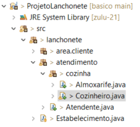

# Fundamentos da Programação Orientada a Objetos com Java


## Orientação a Objetos

- Assusntos
    - Conceito de POO
    - Pacotes e Visibilidade de recursos
    - Classes e Construtores
    - Java Beans e UML
    - Pilares do POO
    - Enums e Interfaces


### Conceitos de POO

O POO é um paradigma de programação baseado no conceito de "objetos", que podem conter dados na forma de campos, também conhecidos como *atributos*, e códigos, na forma de procedimentos, também conhecidos como métodos.

O que precisamos entender, é que cada vez mais linguagens se adequam ao cenário real, proporcionando assim que o programador desenvolva algoritimos mais próximo de fluxos comportamentais, logo tudo ao nosso redor pe representado como Objeto.

> Enquanto a programação estruturada é voltada a procedimentos e funções definidas pelo usuário, a programação orientada a objetos é voltada a conceitos como o de classes e objetos.

### Classes

Toda a estrutura de código na linguagem Java é distribuido em arquivos com extensão **.java** denominados de **classe.**

As classes existentes em nosso projeto serão compostas por:

**Identificador, Características e Comportamentos.**

- **Classe** *(class)*: A estrutura e ou representação que direciona a criação dos objetos de mesmo tipo.

- **Identificador** *(identity)*: Propósito existencial aos objetos que serão criados.

- **Características** *(states)*: Também conhecido como **atributos** ou **propriedades**, é toda informação que representa o estado do objeto.

- **Comportamentos** *(behavior)*: Também conhecido como **ações** ou **métodos**, é toda parte comportamental que um objeto dispõe.

- **Instanciar** *(new)*: É o ato de criar um objeto a partit de estrutura definida em uma classe.


Iremos reproduzir está imagem em forma de código

// inserir codigo

Seguindo algumas convenções, as classes são classificadas como:

- **Classe de modelo (model)**: classes que representam estruturas de comínio da aplicação, exemplo: Cliente, Pedido, Nota Fiscal e etc.
- **Classe de serviço (service)**: classes que contém regras de negócio e validação de nosso sitema.
- **Classe de repositório (repository)**: classes que contém uma integração com banco de dados.
- **Classe de controle (controller)**: classes que possuem a finalidade de disponibilizar alguma comunicação extrena à nossa aplicação, tipo http web ou webservices.
- **Classe utilitária (util)**: classe que contém recursos comuns à toda nossa aplicação.

---

### Pacotes

A linguagem Java é composta por milhares de classes com as finalidades de, por exemplo: Classes de tipos de dados, representação de texto, números, datas, arquivos e diretórios, conexão a banco de dados, entre outras.

Para prevenir de acontecer uma desorganização de arquivos, a linguagem dispõe de um recurso que organiza as classes padrão e criadas por nós, que conhecemos como pacotes (package). Os pacotes são subdiretórios a partir da pasta src do nosso projeto onde estão localizadas as classes da linguagem e novas que forem criadas para o projeto. Existem algumas convenções para criação de pacotes já utilizados no mercado.

**Nomeclatura**

vamos imaginar que a sua empresa se chama **Power Soft** e ela está desenvolvendo sofftwares comercial, governamental e um software livre ou de código aberto. Abaixo teríamos os pacotes sugeridos conforme tabela abaixo: 

- **Comercial**: com.powersoft
- **Governamental**: gov.powersoft
- **Código aberto**: org.powersoft

**Identificação**

Quando uma classe é organizado por pacotes, ela passa a ter duas identificações. O nome simples (**próprio nome**) e agora o nome qualificado (**endereçamento do pacote + nome**).


**Package versus Import**

A localização de uma classe é definida pela palavra reservada package, logo, uma classe só contém uma definição de package no arquivo, sempre na primeira linha do código. Para utilização de uma classe existentes em outros pacotes, necessitamos realizar a importação das mesmas, seguindo a recomendação abaixo: 

```Java
package

import ...
import ...

public class MinhaClasse{

}
```

---

### Visibilidade dos recursos

**Modificadores**

Em Java, utilizamos três palavras reservadas e um conceito default (sem nenhuma palavra reservada) para definir os quatro tipo de visibilidade de atributos, métodos e até mesmo classes no que se refere ao acesso por outras classes.

Para uma melhor ilustração, iremos representar os conceitos de visibilidade de recursos através do contexto em uma lanchonete que vende lanche natural e suco.

*Modificador public*

Como o próprio nome representa, quando nossa classe, método e atributo é definido com public, qualquer outra classe em qualquer outro pacote pode visualizar tais recursos.

**Class Atendente**
```Java
package lanchonete;

public class Atendente {

	public void servindoMesa() {
		// ...?
		System.out.println("SERVINDO MESA");
	}
	
	public void pegarLancheCozinha() {
		System.out.println("PEGANDO O LANCHE NA COZINHA");
	}
	
	public void receberPagamento() {
		System.out.println("RECEBANDO PAGAMENTO");
	}
	
	public void trocarGas() {
		System.out.println("ATENDENTE TROCANDO O GAS");
	}
	
	public void pegarPedidoBalcao() {
		System.out.println("PEGANDO O PEDIDO NO BALCAO");
	}
}
```

**Class Almoxarife**
```Java
package lanchonete;

public class Almoxarife {

	public void controlarEntrada() {
		System.out.println("CONTROLANDO A ENTRADA DOS ITENS");
	}
	
	public void controlarSaida() {
		System.out.println("CONTROLANDO A SAIDA DOS ITENS");
	}
	
	public void entregarIgredientes() {
		System.out.println("ENTREGANDO INGREDIENTES");
		// ...?
	}
	
	public void trocarGas() {
		System.out.println("ALMOXARIFE TROCANDO O GAS");
	}
	
}

```

**Class Cliente**
```Java
package lanchonete;

public class Cliente {
	
	public void escolherLanche() {
		System.out.println("ESCOLHANDO O LANCHE");
	}
	
	public void fazerPedido() {
		System.out.println("FAZENDO O PEDIDO");
	}
	
	public void pagarConta() {
		System.out.println("PAGANDO A CONTA");
	}
	
	public void consultarSaldoAplicativo() {
		System.out.println("CONSULTANDO SALDO NO APLICATIVO");
	}
	
	public void pegarPedidoBalcao() {
		System.out.println("PEGANDO O PEDIDO NO BALCAO");
	}
}
```

**Class Cozinheiro**
```Java
package lanchonete;

public class Cozinheiro {

	public void adicionarLancheNoBalcao() {
		System.out.println("ADICIONANDO LANCHE NATURAL HAMBURGER NO BALCAO");
	}

	public void adicionarSucoNoBalcao() {
		System.out.println("ADICIONANDO SUCO NO BALCAO");
	}

	public void adicionarComboNoBalcao() {
		adicionarLancheNoBalcao();
		adicionarSucoNoBalcao();
	}

	public void prepararLanche() {
		System.out.println("PREPARENDO LANCHE TIPO HAMBURGUER");
	}

	public void prepararVitamina() {
		System.out.println("PRAPARANDO SUCO");
	}

	public void prepararCombo() {
		prepararLanche();
		prepararVitamina();
	}

	public void selecionarIngredientesLanche() {
		System.out.println("SELECIONADO O PÃO, OVO E CARNE");
	}

	public void selecionarIngredientesVitamina() {
		System.out.println("SELECIONADO FREUTA, LEITE E SUCO");
	}

	public void lavarIngredientes() {
		System.out.println("LAVANDO INGREDIENTES");
	}

	public void baterVitaminaLiquidificador() {
		System.out.println("BATENDO VITAMINA LIQUIDIFICADOR");
	}

	public void fritarIngredietesLanche() {
		System.out.println("FRITANDO A CARNE E OVO PARA O HAMBURGER");
	}

	public void pedirParaTrocarGas(Atendente meuAmigo) {
		meuAmigo.trocarGas();
	}

	public void pedirParaTrocarGas(Almoxarife meuAmigo) {
		meuAmigo.trocarGas();
	}

	public void pedirIngedientes(Almoxarife almoxarife) {
		almoxarife.entregarIgredientes();;
	}
}

```

**Class Estabelecimento**
```Java
package lanchonete;

public class Estabelecimento {

	public static void main(String[] args) {

		Cozinheiro cozinheiro = new Cozinheiro();

		// açoes que não precisam estarem disponíveis para toda a aplicação

		cozinheiro.lavarIngredientes();
		cozinheiro.baterVitaminaLiquidificador();
		cozinheiro.selecionarIngredientesVitamina();
		cozinheiro.prepararLanche();
		cozinheiro.prepararVitamina();
		cozinheiro.prepararVitamina();

		// ações que o estabelecimento precisa ter ciência

		cozinheiro.adicionarSucoNoBalcao();
		cozinheiro.adicionarLancheNoBalcao();
		cozinheiro.adicionarComboNoBalcao();

		Almoxarife almoxarife = new Almoxarife();

		// açoes que não precisam estarem disponíveis para toda a aplicação
		almoxarife.controlarEntrada();
		almoxarife.controlarSaida();

		// ações que somente o seu pacote cozinha precisa conhecer (default)

		almoxarife.entregarIgredientes();
		almoxarife.trocarGas();

		Atendente atendente = new Atendente();

		atendente.pegarLancheCozinha();
		atendente.receberPagamento();
		atendente.servindoMesa();

		// ação que somente o seu pacote cozinha precisa conhecer (default)

		atendente.trocarGas();

		Cliente cliente = new Cliente();

		cliente.escolherLanche();
		cliente.fazerPedido();
		cliente.pagarConta();

		// não deveria, mas o estabelecimento ainda não definio normas de atendimento
		cliente.pegarPedidoBalcao();

		// esta ação é muito sigilosa, que tal ser privada?
		cliente.consultarSaldoAplicativo();

		// já pensou os clientes ouvindo que o gás acabou?
		cozinheiro.pedirParaTrocarGas(atendente);
		cozinheiro.pedirParaTrocarGas(almoxarife);
	}

}
```

*Modificador default*

O modificador *default* está fortemente associado a organização das classes por pacotes, algumas implementações não precisam estar disponíveis por todo o projeto, e é este modificador de acesso que restrige a visibilidade por pacotes.

Dentro do pacote **lanchonete**, iremos criar dois sub-pacotes para representar a divisão do estabelecimento.

- **lanchonete.atendimento.cozinha**: pacote que contém classes da parte da cozinha da lanchonete e atendimentos.
- **lanchonete.area.cliente**: pacote que contém classes relacionadas ao espaço do cliente.



**Modificador private**

Depois de reestruturar nosso estabelecimento(projeto), onde, temos as divisões (pacotes) espaço do cliente e atendimento, chegou a hora de uma reflexão sobre visibilidade ou modificadores de acesso.

Conhecemos as ações disponíveis nas classes Cozinheiro, Almoxarife, Atendente e Cliente, mesmo com a organização da visibilidade por pacotes, será se realmente estas classes precisam ser tão explicitas?

- Será se o Cozinheiro precisa saber que\como o Almoxarife controle as entradas e saídas?
- Que o Cliente precisa saber como o Atendente receve o pedido  para servir sua mesa?
- Que o Atendente precisa saber que antes de pagar o Cliente consulta o saldo no App?

### Getters e Setters

Seguindo a convensão Java Beans

Os métodos "Getters" e "Setters" são utilizados para buscar valores de atributos ou definir novos valores de atributos de instância de classes.

O método **Getter** retorna o valor do atributo especificado.

O método **Setter** define outro novo valor para atributo especificado.

Seguindo a convensão Java Beans, uma classe que contém está estrutura de estados deverá seguir as regras abaixo:

- Os atributos precisam ter o modificador de acesso **private**. Ex.: private String nome;

- Como agora os atributos estarão somente a nível de classe, precisamos dos métodos **get**X e **set**X. Ex.: getNome() e setNome(String novoNome);

- O método **get** é responsável por obter o valor atual do atributo, logo ele precisa ser public retornar um tipo correspondente ao valor. Ex.: public String getNome() {};

- O método **set** é responsável por definir ou modificador o valor de um atributo em um objeto, logo ele também precisa ser public, receber um parâmetro do mesmo tipo de variável mas não retorna nenhum valor void. Ex.: public void setNome(String novoNome);
